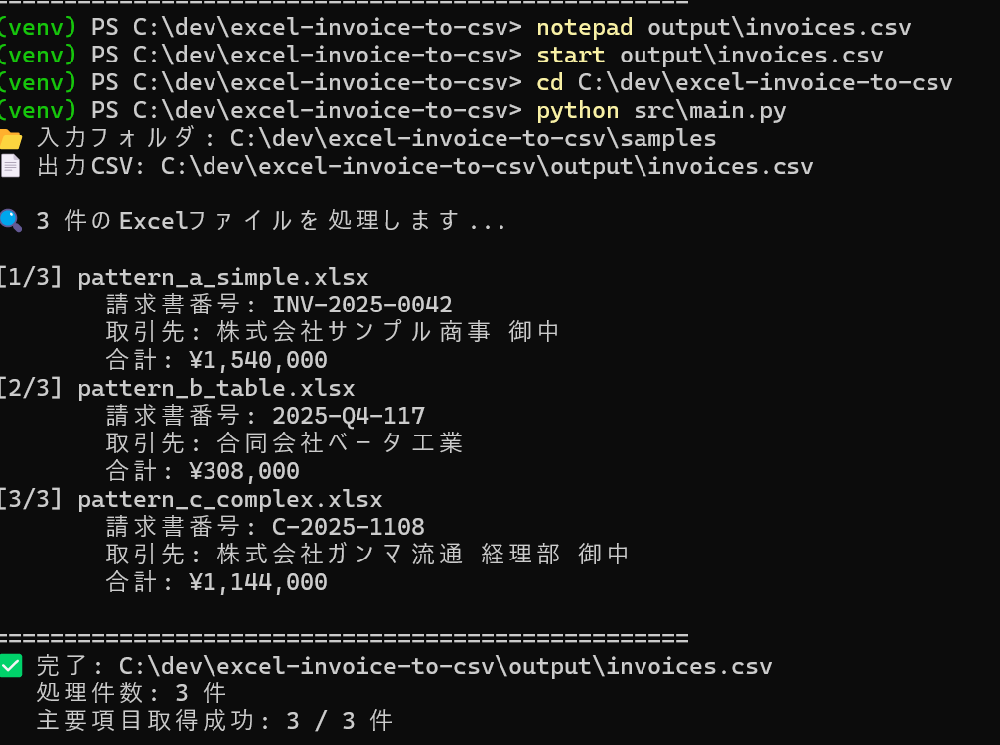
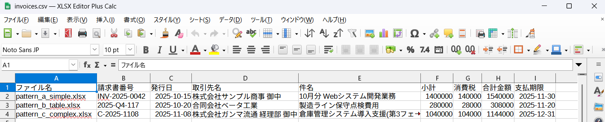

# 📊 Excel請求書 一括CSV化ツール

> **Excel形式で受け取った請求書を、ボタン一つで集約CSVに変換。**
> 月次の請求書一覧作成、会計ソフト取り込み用データ作成を自動化します。

[](https://www.python.org/)
[](https://opensource.org/licenses/MIT)
[](https://openpyxl.readthedocs.io/)
[](https://github.com/tarou0919/excel-invoice-to-csv/releases)

---

## 🆕 v2.0 の新機能

- 🎨 **YAMLルール外部化** — メモ帳で抽出ルールを編集可能(Pythonの知識不要)
- 🔀 **複数ルールの切り替え** — 顧客ごとに専用ルールファイルを使い分け
- 🛡️ **堅牢なエラー処理** — 壊れたExcelが混在しても止まらない
- 📝 **詳細ログ出力** — `--verbose` でデバッグ可能、`--log-file` で記録
- ✨ **独自項目の追加** — 「担当部署」「PJコード」など自由に追加可能

---

## 🎯 こんな方におすすめ

- 📥 **取引先から毎月20〜50件のExcel請求書が届く**経理担当者
- 📋 **請求書一覧を手作業でコピペしている**中小企業の経理部門
- 💼 **会計ソフトへの一括取り込みデータ**を作りたい税理士事務所
- 🏢 **複数フォーマットの請求書**が混在していて困っている方

---

## ⚡ 何ができる?

```
┌──────────────────────┐         ┌──────────────────────┐
│ 📂 samples/          │         │ 📄 invoices.csv      │
│  ├ 請求書A.xlsx      │   ──>   │                      │
│  ├ 請求書B.xlsx      │         │ ファイル名,請求書番号│
│  └ 請求書C.xlsx      │         │ 発行日,取引先,合計... │
└──────────────────────┘         └──────────────────────┘
   フォーマット混在OK              1つのCSVに集約
```

### 抽出される項目(デフォルト9項目・カスタマイズ可能)

| # | 項目 | 例 |
|---|------|-----|
| 1 | ファイル名 | `pattern_a_simple.xlsx` |
| 2 | 請求書番号 | `INV-2025-0042` |
| 3 | 発行日 | `2025-10-15` |
| 4 | 取引先名 | `株式会社サンプル商事 御中` |
| 5 | 件名 | `10月分 Webシステム開発業務` |
| 6 | 小計 | `1,400,000` |
| 7 | 消費税 | `140,000` |
| 8 | 合計金額 | `1,540,000` |
| 9 | 支払期限 | `2025-11-30` |

---

## 🌟 主な特徴

### ✅ 複数フォーマット対応
| パターン | レイアウト | 対応状況 |
|---------|----------|---------|
| シンプル型 | 縦並び1シート | ✅ |
| 表形式型 | 2列レイアウト+セル結合 | ✅ |
| 複雑型 | 複数シート+備考欄 | ✅ |

### ✅ ラベル探索方式
セル位置を固定せず、「請求書番号」「ご請求金額」などの**ラベルを探して値を取得**。多少レイアウトが違っても動作します。

### ✅ 結合セル対応
セル結合の起点を自動検出。複雑な書式でも正しく値を抽出します。

### ✅ 多段フォールバック
ラベルが見つからなくても:
- 取引先名 → 「御中」「様」を含むセルから抽出
- 合計金額 → 数値セルの最大値から抽出
- 合計金額 → 小計+消費税から自動計算

### ✅ 日付の自動正規化
`2025年10月15日` も `2025/10/15` も `2025-10-15` に統一。

### ✅ Excel互換CSV出力
`UTF-8 BOM` 付きで、Excelで開いても文字化けしません。

### 🆕 ✅ YAMLルール外部化
抽出ルールが `rules/default.yaml` に分離。メモ帳で編集できます。

### 🆕 ✅ エラーに強い
壊れたExcelが混じっていてもスキップして継続。エラーは記録されます。

---

## 🚀 使い方(3ステップ)

### 1. インストール

```bash
# リポジトリをクローン
git clone https://github.com/tarou0919/excel-invoice-to-csv.git
cd excel-invoice-to-csv

# 仮想環境を作成・有効化
python -m venv venv
venv\Scripts\activate          # Windows
# source venv/bin/activate     # Mac/Linux

# 依存ライブラリをインストール
pip install -r requirements.txt
```

### 2. Excel請求書を配置

`samples/` フォルダに変換したいExcelファイルを置きます。

```
excel-invoice-to-csv/
├── samples/
│   ├── 請求書_A社_2025年10月.xlsx
│   ├── 請求書_B社_2025年10月.xlsx
│   └── 請求書_C社_2025年10月.xlsx
```

### 3. 実行

```bash
python src\main.py
```

`output/invoices.csv` に集約されたCSVが出力されます。

---

## 🔧 高度な使い方

### カスタムパス指定

```bash
python src\main.py "C:\path\to\input_dir" "C:\path\to\output.csv"
```

### 🆕 顧客ごとに専用ルールを使う

```bash
# A社専用ルール
python src\main.py --rules rules\customer_a.yaml

# B社専用ルール
python src\main.py samples\b_company\ output\b_company.csv --rules rules\customer_b.yaml
```

### 🆕 詳細ログを表示(デバッグ用)

```bash
# 画面に詳細ログ表示
python src\main.py --verbose

# ファイルに詳細ログ保存
python src\main.py --verbose --log-file logs\run.log
```

### 🆕 ヘルプ表示

```bash
python src\main.py --help
```

---

## 📸 動作イメージ

### 実行画面
コマンド一発で複数のExcel請求書を一括処理。進捗が見やすく、抽出成功率も表示されます。



### 出力CSV
9列すべて正しく抽出・整形済み。Excel/Calc/Numbersでそのまま開けます(UTF-8 BOM対応)。



#### CSV内容(テーブル表示)

| ファイル名 | 請求書番号 | 発行日 | 取引先名 | 件名 | 小計 | 消費税 | 合計金額 | 支払期限 |
|-----------|-----------|--------|---------|------|------|--------|---------|---------|
| pattern_a_simple.xlsx | INV-2025-0042 | 2025-10-15 | 株式会社サンプル商事 御中 | 10月分 Webシステム開発業務 | 1,400,000 | 140,000 | 1,540,000 | 2025-11-30 |
| pattern_b_table.xlsx | 2025-Q4-117 | 2025-10-20 | 合同会社ベータ工業 | 製造ライン保守点検費用 | 280,000 | 28,000 | 308,000 | 2025-11-20 |
| pattern_c_complex.xlsx | C-2025-1108 | 2025-11-08 | 株式会社ガンマ流通 経理部 御中 | 倉庫管理システム導入支援(第3フェーズ) | 1,040,000 | 104,000 | 1,144,000 | 2025-12-31 |

---

## 📁 プロジェクト構成

```
excel-invoice-to-csv/
├── samples/                      # 入力Excelファイル(.xlsx)
│   ├── pattern_a_simple.xlsx
│   ├── pattern_b_table.xlsx
│   └── pattern_c_complex.xlsx
├── rules/                        # 🆕 抽出ルール(YAML)
│   ├── default.yaml              # デフォルトルール
│   └── customer_example.yaml     # カスタマイズ例
├── src/                          # ソースコード
│   ├── rules_loader.py           # 🆕 YAMLルール読込
│   ├── extractor.py              # Excel抽出コア
│   ├── csv_writer.py             # CSV出力
│   └── main.py                   # エントリーポイント
├── output/                       # 生成されるCSV
│   └── invoices.csv
├── logs/                         # 🆕 ログファイル(--log-file使用時)
├── docs/
│   └── images/
├── requirements.txt
├── LICENSE
└── README.md
```

---

## 🔧 抽出ルールのカスタマイズ

### 既存ルールの編集

`rules/default.yaml` をメモ帳などで開いて編集します:

```yaml
extraction_rules:
  請求書番号:
    labels:
      - 請求書番号       # ← ここに自社で使われている呼び方を追加
      - Invoice No
      - 伝票番号        # ← 例:このように追加
    direction: right
    data_type: text
```

### 新しい項目の追加

```yaml
extraction_rules:
  # ... 既存の項目 ...

  # 独自項目を追加
  担当部署:
    labels:
      - 担当部署
      - 部門
    direction: right
    data_type: text

csv_columns:
  - ファイル名
  - 請求書番号
  - 担当部署              # ← CSV出力にも追加
  # ... 他の項目 ...
```

### 顧客ごとに別ファイルを作る

```bash
# A社専用ルール作成
copy rules\default.yaml rules\customer_a.yaml
# rules\customer_a.yaml を編集してA社専用に

# A社の請求書だけ処理
python src\main.py samples\a_company --rules rules\customer_a.yaml
```

詳しいカスタマイズ例は [`rules/customer_example.yaml`](rules/customer_example.yaml) を参照。

---

## 🛠 技術スタック

- **Python 3.10+**
- **openpyxl 3.1.5** — Excelファイル読み込み
- **PyYAML 6.0+** — 🆕 YAMLルールファイル解析
- **pandas 2.0+** — データ処理
- **python-dotenv** — 環境変数管理

---

## 📊 抽出精度

サンプル3パターン × 9項目 = **27項目で100%の抽出成功率**を達成。

| パターン | 抽出成功項目 |
|---------|-------------|
| シンプル型 | 9/9 ✅ |
| 表形式型 | 9/9 ✅ |
| 複雑型 | 9/9 ✅ |

---

## 🤝 商用利用について

このリポジトリのコードは MIT License のもと、商用利用を含めて自由にお使いいただけます。

**フォーマットカスタマイズ・本番運用サポートが必要な場合**は、以下からご相談ください:

- 💼 ココナラ: [サービスページ](https://coconala.com/services/4211526)(請求書OCRサービス)
- 🐦 X(Twitter): [@tarou0919](https://twitter.com/tarou0919)

### こんなカスタマイズに対応可能
- 自社特有のExcelフォーマット対応(2〜3パターン追加)
- 弥生会計・freee・MFクラウド向けCSVフォーマット出力
- 明細行レベルでの抽出
- メール添付Excelの自動取り込み
- 月次自動実行(タスクスケジューラ連携)

---

## 📜 ライセンス

[MIT License](LICENSE)

---

## 🙏 関連プロジェクト

このツールは姉妹プロジェクトとして以下を公開しています:

- [請求書OCR自動化サービス](https://github.com/tarou0919/invoice-ocr-automation) — PDF/画像からの請求書OCR

---

## 📝 変更履歴

### v2.0 (2026-05-11)
- 🆕 YAMLルール外部化
- 🆕 CLI引数対応(`--rules`, `--verbose`, `--log-file`)
- 🆕 エラー処理強化(壊れたExcelで止まらない)
- 🆕 詳細ログ機能

### v1.0 (2026-05-10)
- 🎉 初回リリース
- ✅ 3種類のフォーマット対応
- ✅ ラベル探索方式
- ✅ 結合セル対応
- ✅ 多段フォールバック

---

⭐ お役に立ったらStarをお願いします!
